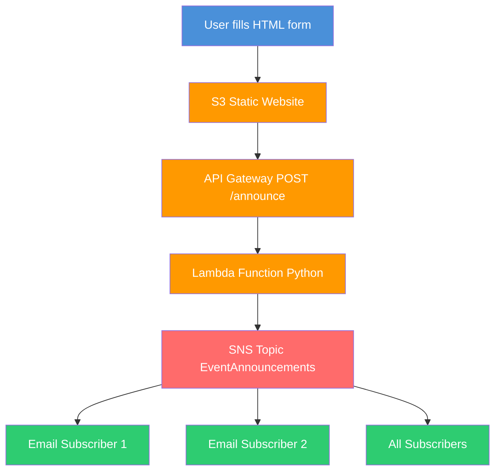

# AI Chatbot — Powered by Claude API

A production-ready conversational AI chatbot built with Python and Anthropic Claude API.
Designed to answer questions about AWS cloud services, 5G network architecture, and tech career guidance.

---

## Why I built this

As a Nokia 5G Packet Core Engineer transitioning into AI/Cloud Engineering, I built this project to demonstrate hands-on AI API integration skills. This chatbot connects real infrastructure knowledge with modern AI tooling — exactly what cloud and AI engineering roles require.

---

## What it does

- Answers questions about AWS services, cloud architecture, and DevOps
- Understands 5G network and telecom infrastructure topics
- Provides career guidance for tech roles in Canada
- Runs as an interactive command line application
- Handles errors gracefully with try/except blocks
- Loads API credentials securely using environment variables

---

## Technologies used

| Technology | Purpose |
|-----------|---------|
| Python 3 | Core programming language |
| Anthropic Claude API | AI language model integration |
| claude-haiku model | Fast, cost-efficient AI responses |
| python-dotenv | Secure API key management |
| Environment variables | Production-grade secret handling |

---

## Skills demonstrated

- AI API integration with real production model
- Secure credential management using .env and .gitignore
- Python error handling with try/except
- Interactive CLI application design
- Clean, readable, well-commented code

---

## How to run it locally

**Step 1 — Clone the repo:**
```bash
git clone https://github.com/sadvi11/ai-chatbot-claude.git
cd ai-chatbot-claude
```

**Step 2 — Install dependencies:**
```bash
pip3 install anthropic python-dotenv
```

**Step 3 — Set up your API key:**

Create a `.env` file in the project folder:
```
ANTHROPIC_API_KEY=your-api-key-here
```

Get your free API key at: https://console.anthropic.com

**Step 4 — Run the chatbot:**
```bash
python3 ai_chatbot.py
```

**Step 5 — Ask anything:**
```
========================================
   AI CHATBOT — powered by Claude
   Type 'quit' to exit
========================================

You: What is the difference between AWS EC2 and Lambda?

Claude: Great question! Here is the key difference...
```

---

## Example questions to try

```
What is AWS Lambda and when should I use it?
How does 5G core network architecture relate to cloud computing?
What is the difference between DevOps and MLOps?
What Python skills do I need for a Cloud Engineer role in Canada?
Explain serverless architecture in simple terms
```

---

## Project structure

```
ai-chatbot-claude/
├── ai_chatbot.py       # Main chatbot application
├── .env                # API key (not pushed to GitHub)
├── .gitignore          # Protects secret files from GitHub
└── README.md           # Project documentation
```

---

## Security implementation

This project follows production security best practices:

- API keys are stored in `.env` file — never hardcoded in code
- `.gitignore` prevents secrets from being pushed to GitHub
- `os.environ.get()` loads credentials at runtime
- No sensitive data exists in commit history

---

## What I learned

- How to integrate a real AI API into a Python application
- How to manage API credentials securely in production
- How to build interactive CLI applications in Python
- How to handle API errors gracefully
- How environment variables work in real cloud applications

---

## Connect with me

I am actively looking for AI Engineer, Cloud Engineer, and MLOps roles in Canada.

- GitHub: github.com/sadvi11
- Email: sadhvikhajuria@gmail.com
- Certification: AWS Solutions Architect Associate
- Background: Nokia 5G Packet Core Engineer

If you are hiring or know someone who is — let's connect!

---

## Other projects in my portfolio

| Project | Tech stack |
|---------|-----------|
| Spam Classifier | Python, Naive Bayes, Flask REST API |
| Serverless File Processor | AWS Lambda, Python |
| AWS EC2 Instance Checker | Python, boto3 |
| AI S3 Document Analyser | Python, AWS S3, AI |
| AI Chatbot | Python, Claude API |

---

*Built by Sadhvi Khajuria — Nokia 5G Engineer transitioning into AI/Cloud Engineering in Canada*

## Architecture


