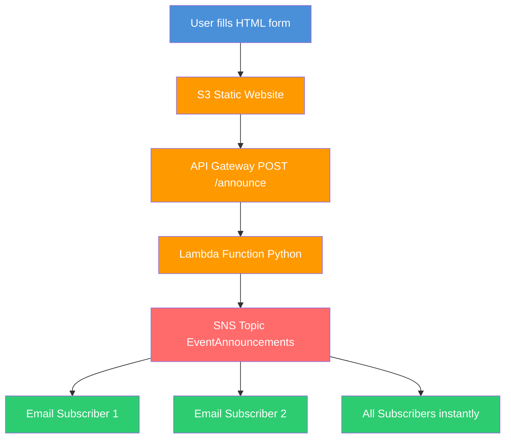

# Event Announcement System

Serverless event notification system built with AWS SNS Lambda API Gateway and S3.
Send announcements to thousands of subscribers instantly with zero infrastructure management.

## Architecture



## Real Canadian Use Case

RBC needs to notify 15 million customers of a fraud alert instantly.
Manual email chain takes hours. This system delivers to all subscribers in seconds.
Same architecture used by Canadian banks telecoms and government agencies.

## What It Does

- User submits event via web form hosted on S3
- API Gateway receives POST request and triggers Lambda
- Lambda publishes to SNS topic
- All subscribers receive email notification instantly
- End to end delivery under 2 seconds

## Tech Stack

| Service | Purpose |
|---|---|
| AWS SNS | Pub/sub notification delivery |
| AWS Lambda | Serverless Python function |
| AWS API Gateway | REST endpoint |
| AWS S3 | Static frontend hosting |
| Python 3.11 | Lambda runtime |
| ca-central-1 | Canadian data residency |

## Screenshots

### API Test Success - Status 200


### Email Notification Received


### Lambda Deployed in Canada Central


## Test

```bash
curl -X POST YOUR_API_GATEWAY_URL/announce \
  -H "Content-Type: application/json" \
  -d '{"title": "Event Name", "message": "Event details", "email": "your@email.com"}'
```

Expected response:
```json
{"message": "Announcement sent", "status": "success"}
```

## Nokia Connection

At Nokia I worked with pub/sub messaging for 5G network alarm notifications.
When a network node had a fault it published to a message bus.
Every subscribed system received the alert simultaneously.

AWS SNS is the exact same pattern.
Nokia pub/sub = AWS SNS
Network alarms = Event announcements
I already understood this architecture. I just needed to learn the AWS names.

## Author

Sadhvi Sharma | Cloud Engineer and AI Engineer | Nokia 5G and AWS
AWS Solutions Architect Associate certified
Permanent Resident available anywhere in Canada immediately
github.com/sadvi11 | linkedin.com/in/sadhvi-sharma-5789a6249
