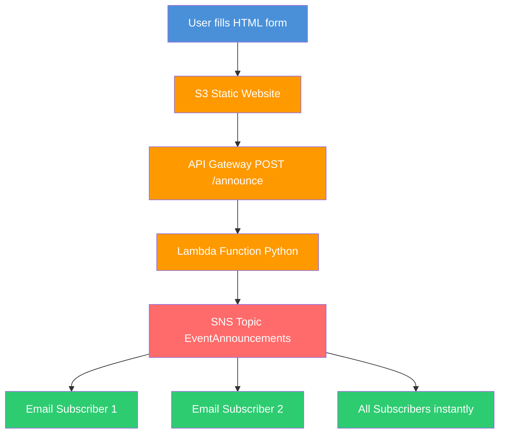

# Event Announcement System

Serverless event notification system built with AWS SNS Lambda API Gateway and S3.

## Real Canadian Use Case

RBC needs to notify 15 million customers of a fraud alert instantly.
Manual email takes hours. This system delivers in seconds.

## What It Does

- User submits event via web form
- API Gateway triggers Lambda function
- Lambda publishes to SNS topic
- All subscribers receive email instantly

- ## Architecture

## Tech Stack

- AWS SNS pub/sub notifications
- AWS Lambda serverless Python function
- AWS API Gateway REST endpoint
- AWS S3 static frontend hosting
- ca-central-1 Canadian data residency

## Screenshots

See screenshots folder for proof of deployment and working system.

## Nokia Connection

At Nokia I used pub/sub messaging for 5G network alarm notifications.
AWS SNS is the exact same pattern.
I already understood this architecture.
I just needed to learn the AWS names.

## Author

Sadhvi Sharma | Cloud and AI Engineer | Nokia 5G and AWS
AWS Solutions Architect Associate certified
Permanent Resident available anywhere in Canada
github.com/sadvi11
